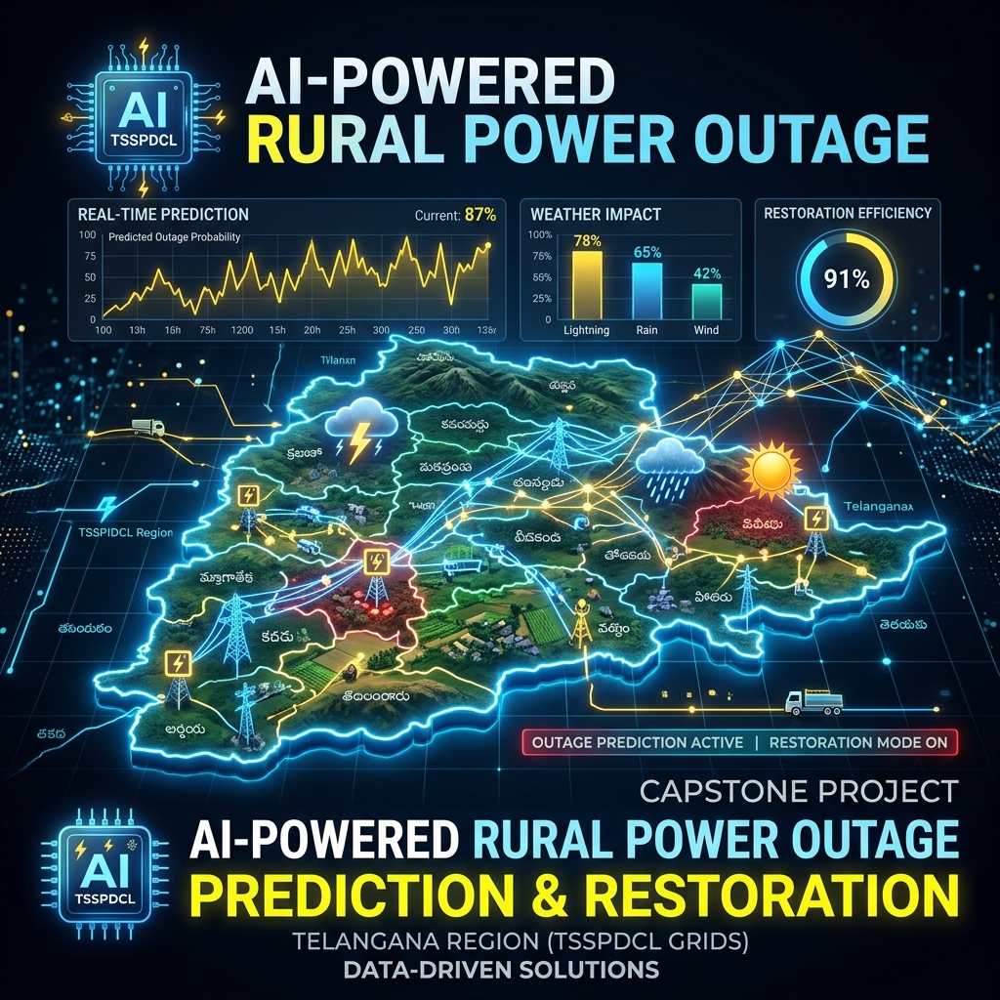
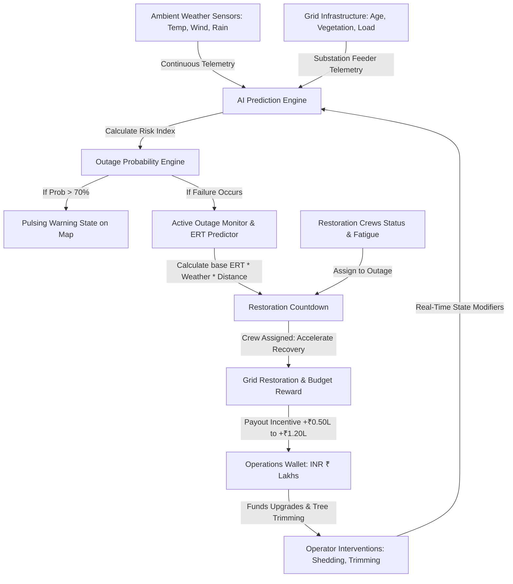
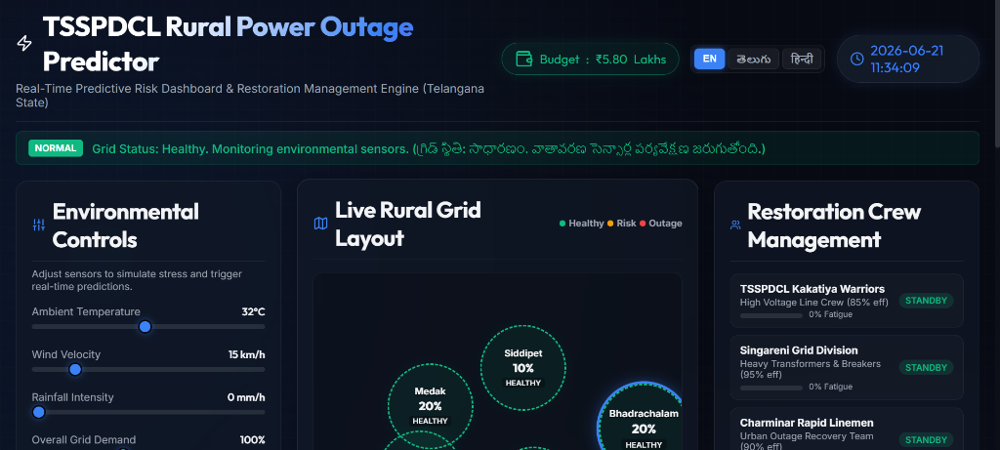

# AI-Powered Rural Power Outage Prediction & Restoration System (TSSPDCL Edition)

<p align="center">
  
</p>

This repository hosts a high-fidelity, interactive **Predictive Risk Dashboard & Restoration Management Engine** calibrated for rural electricity distribution grids in Telangana. It simulates environmental stressors (temperature, cyclonic winds, monsoon rainfall) and grid loads to forecast outage probabilities and calculate Estimated Restoration Times (ERT) for the **TSSPDCL (Southern Power Distribution Company of Telangana Limited)** grid.

---

## ⚡ Problem Statement
In rural India, specifically across Telangana's agricultural belts, unexpected grid failures disrupt critical crop irrigation, power loom industries, and household life. Traditional outage responses are reactive. 
* **The Solution**: An AI-guided prediction system that models meteorology, vegetation drag, and substation overload. It empowers grid operators to take preemptive actions (like smart load shedding or vegetation trimming) and dynamically dispatches crews to speed up restoration when outages occur.

---

## 🗺️ System Workflow & Architecture
Below is the operational data flow within the system, visualizing how weather sensors, grid load factors, and operator maintenance budgets interact:



---

## 📈 Underlying Mathematical Models

### 1. Grid Outage Probability Model
The system computes real-time probability index $P(Outage)$ for each sector:
$$P(Outage) = P(Base) + P(Wind) + P(Thermal) + P(Leakage)$$

* **Wind Drag Stress $P(Wind)$**: Models the effect of gale forces on transmission lines running near tree canopies.
  $$P(Wind) = \left(\frac{\text{Wind Speed}}{90}\right)^{2.2} \times \text{Tree Cover} \times (\text{Trimming ? } 0.25 : 1.0) \times 0.65$$
* **Thermal Overload $P(Thermal)$**: Models core transformer heating and demand spikes.
  $$P(Thermal) = \max\left(0, \frac{\text{Temp} - 35}{15}\right) \times 0.15 + \left(\frac{\text{Active Load}}{\text{Capacity}}\right)^{3.5} \times 0.45 \times \text{Age Factor}$$
* **Insulator Leakage $P(Leakage)$**: Models flashover leakage on insulators due to rain conductivity.
  $$P(Leakage) = \left(\frac{\text{Rainfall}}{100}\right) \times \left(\frac{\text{Component Age}}{15}\right) \times 0.18$$

### 2. Estimated Restoration Time (ERT) Engine
Once a sector trips, the ERT is modeled as:
$$\text{ERT} = \text{Base Cause Time} \times \text{Weather Multiplier} \times \text{Remoteness Impedance}$$
* **Weather Multiplier**: Heavy rain ($>30\text{mm}$) and strong wind ($>35\text{km/h}$) increase restoration times by up to $+80\%$ due to safety/access hazards.
* **Remoteness Factor**: Remote forest areas (e.g. Bhadrachalam) add a constant travel time multiplier (up to $1.9\times$).

---

## 🛠️ Main Features
* **Interactive Grid Simulator Map**: Custom SVG-connected network layout mapping 5 Telangana stations:
  * **Siddipet Agritech**: Focuses on heavy agricultural pump loads.
  * **Medak Substation**: General mid-capacity distribution node.
  * **Nalgonda Feeder**: Dry climate, low canopy area.
  * **Bhadrachalam Forest**: High tree canopy cover, remote location.
  * **Sircilla Power-loom**: High industrial/textile capacity grid zone.
* **Trilingual Vernacular Interface**: Toggle in one-click between **English (EN)**, **తెలుగు (Telugu)**, and **हिन्दी (Hindi)**. UI headers, charts, crew names, logs, and recommendation widgets swap text nodes immediately.
* **Operational Budget Economy (₹ Lakhs)**: Includes a gamified budget. Grid trimming costs ₹25k; transformer upgrades cost ₹1.5L. Successful outages yield revenue incentives (up to ₹1.2L) back to the state wallet.
* **Crew Dispatch & Fatigue Monitor**: Dispatch specialized units (*TSSPDCL Kakatiya Warriors*, *Singareni Grid Division*, *Charminar Rapid Linemen*). Crews reduce restoration times but accumulate fatigue, requiring shifts of rest.
* **Bilingual Severe Weather Alerts**: Integrated IMD warning banner showing alerts in English/Telugu.

---

## 🖥️ Dashboard Interface Preview
Below is a preview of the interactive dark-mode dashboard simulating environmental stress and substation loading:

<p align="center">
  
</p>

---

## 🚀 Running the Project
Since this is a client-side single-page application built on Vanilla HTML/CSS/JS, it runs directly in the browser and does not require complex development servers.

1. Clone this repository:
   ```bash
   git clone https://github.com/YOUR_USERNAME/AI-POWERED-RURAL-POWER-OUTAGE-PREDICTION-RESTORATION-TSSPDCL.git
   ```
2. Open the directory and double-click **`index.html`** to run in Chrome, Firefox, or Edge.
3. Turn on weather presets like **Monsoon** or **Heatwave** to test real-time risk predictions!
